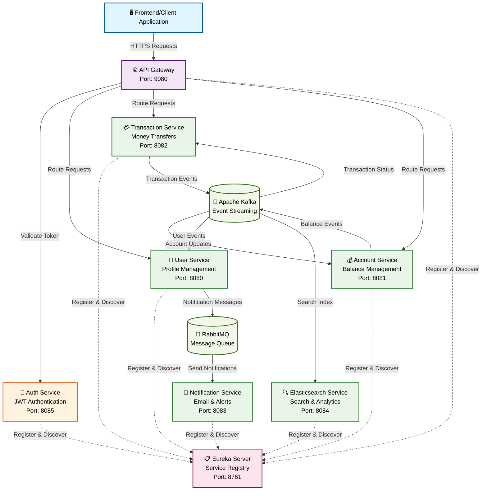

# KoshFlow - Cloud-Native Banking Microservices Platform

## Overview
KoshFlow is a modular, production-grade banking application built with Java, Spring Boot, and Docker. It implements core banking features, leverages event-driven architecture with Kafka and RabbitMQ, and provides robust notification and search capabilities. The system is designed for scalability, extensibility, and future AI integration.

## Architecture
- **Microservices:** Each business domain (accounts, users, transactions, notifications, authentication, search) is a separate Spring Boot service.
- **API Gateway:** Central entry point for all APIs, with JWT-based authentication and routing.
- **Service Discovery:** Eureka registry for dynamic service registration and discovery.
- **Messaging:** Kafka and RabbitMQ for asynchronous, decoupled communication.
- **Persistence:** PostgreSQL for relational data, Elasticsearch for search/analytics.
- **Containerized:** All services and dependencies are orchestrated via Docker Compose.

### Service Architecture Diagram

## Services
| Service                | Description                                 | Port | Link to README |
|------------------------|---------------------------------------------|------|----------------|
| user-service           | Manages user profiles                       | 8080 | [user-service](user-service/README.md) |
| account-service        | Manages user accounts and balances          | 8081 | [account-service](account-service/README.md) |
| transaction-service    | Handles money transfers and history         | 8082 | [transaction-service](transaction-service/README.md) |
| notification-service   | Sends notifications (email, etc.)           | 8083 | [notification-service](notification-service/README.md) |
| elasticsearch-service  | Search/analytics for transactions           | 8084 | [elasticsearch-service](elasticsearch-service/README.md) |
| auth-service           | Handles authentication (JWT)                | 8085 | [auth-service](auth-service/README.md) |
| registry-service       | Eureka service registry                     | 8761 | [registry-service](registry-service/README.md) |
| gateway-service        | API Gateway, routing, JWT validation        | 9080 | [gateway-service](gateway-service/README.md) |

## Sample Business Flow: Transaction Processing
1. **Initiate Transaction:**
   - A user initiates a transaction via the `transaction-service` API.
   - The transaction is validated, saved to the database, and published to Kafka.

2. **Account Processing:**
   - The `account-service` consumes the Kafka event, processes the transaction (e.g., balance updates), and publishes the result back to Kafka.

3. **Transaction Completion:**
   - The `transaction-service` listens for the completion event, updates the transaction status, and publishes it to Elasticsearch for indexing.

4. **User Notification:**
   - The `user-service` listens for the completion event, gathers user details, and sends a message to RabbitMQ.
   - The `notification-service` consumes the RabbitMQ message and sends an email to the user.

## Quick Start (Docker Compose)
1. Clone the repository.
2. Ensure Docker and Docker Compose are installed.
3. Run: `docker-compose up --build`
4. Access services via their respective ports (see table above).

## Prerequisites
- Java 21+
- Maven 3.8+
- Docker & Docker Compose

## Configuration
- Each service has its own `application.properties` for environment-specific settings.
- Common environment variables:
  - Database: `spring.datasource.*`
  - Kafka: `spring.kafka.bootstrap-servers`
  - RabbitMQ: `spring.rabbitmq.*`
  - Eureka: `eureka.client.service-url.defaultZone`
  - JWT Secret (auth-service): `jwt.secret`

## Monitoring & Health
- Spring Boot Actuator endpoints are enabled for all services.
- Eureka dashboard available at `http://localhost:8761`.

## Contributing
1. Fork the repo and create a feature branch.
2. Make changes and add tests.
3. Submit a pull request.

## License
MIT

## Contact
For questions or support, contact: mslalith17@gmail.com
